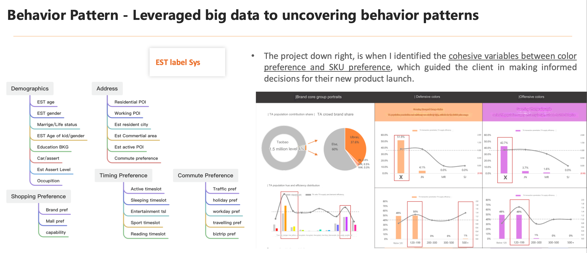
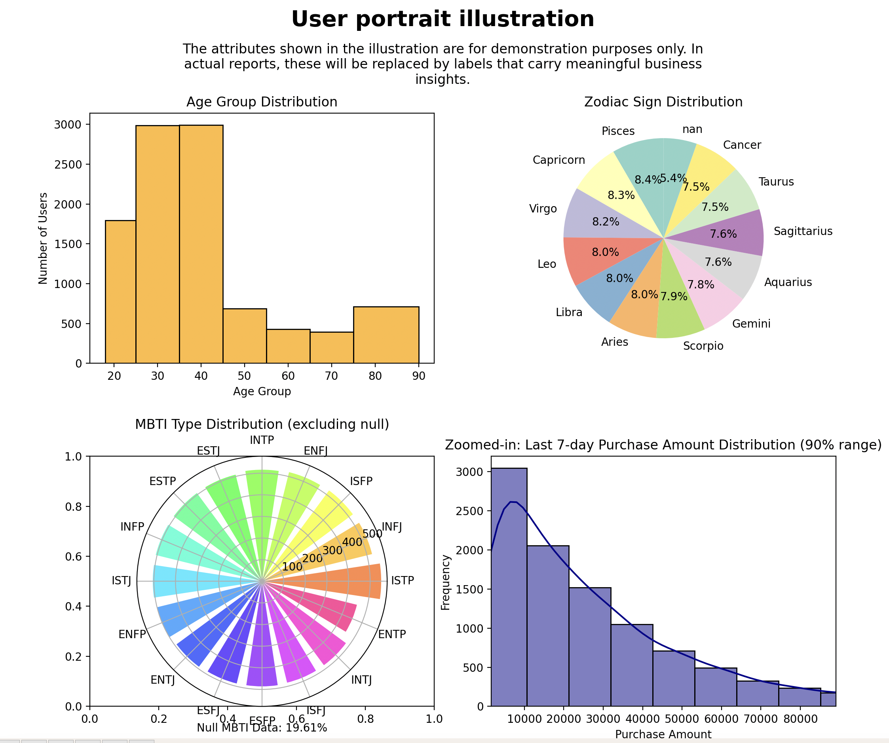
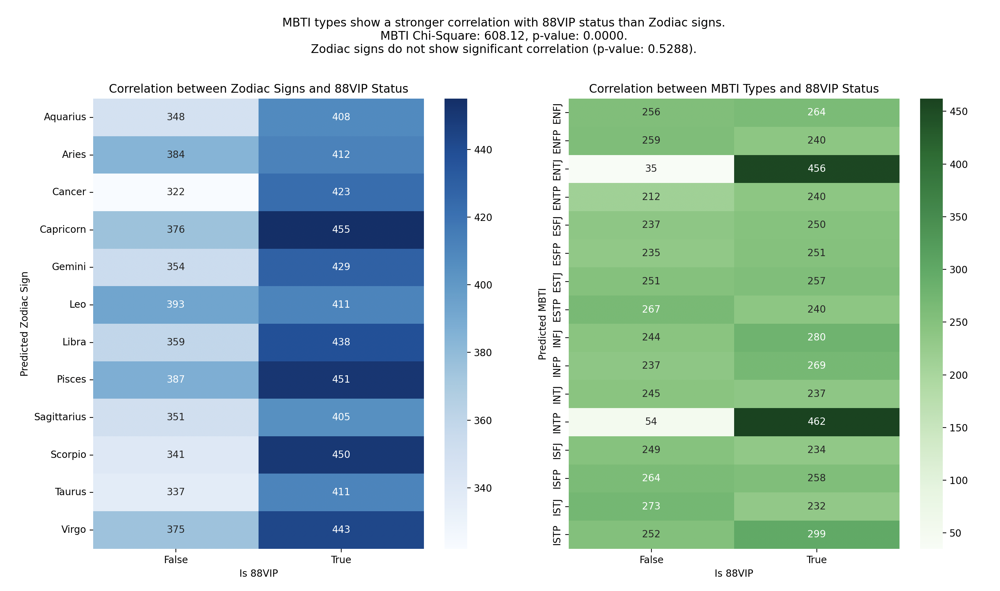

# XiangyuProjects


__DISCLAIMER__
- The data and scenarios presented in this project are entirely fictional and have been generated solely for demonstration purposes.
- All datasets used are mock data, created through scripts to illustrate specific data analysis methods and techniques. 
- None of the data structures, analysis methods, or results should be interpreted as reflective of actual data, operations, or assets of Alibaba or any other organization. 
- This project is not representative of any proprietary or confidential information from Alibaba or any real-world entity. 
- Any resemblance to real-world data is purely coincidental.


__Project Outline__


1. Consumer Profiling and Analysis for E-commerce Platform
- Demographic Analysis: Breakdown of consumer attributes, including age, gender, location, and spending behavior.


- User Clustering via ML: Using machine learning algorithms to segment users into clusters based on purchasing patterns, enabling targeted  marketing and personalized recommendations.



# Project Overview

## Project Dependencies
The project dependencies listed in `requirements.txt` are as follows:

```text
matplotlib==3.9.2
numpy==2.1.1
pandas==2.2.2
scikit_learn==1.5.2
scipy==1.14.1
seaborn==0.13.2
```

## Project Directory Structure
The structure of the project is as follows:

```text
- ./
    - LICENSE
    - requirements.txt
    - READMEtmp.md
    - behavior_pattern.py
    - README.md
    - corelation_explore.py
    - sales_prediction.py
    - user_profile.py
    - images/
        - coralation.png
        - Home.png
        - UserPortrait.png
    - __pycache__/
    - ODPSmocker/
        - data_mocker.py
        - readme_gnr.py
        - user_data_mocker.py
    - data/
        - user_data.csv
        - transaction_data.csv
```
